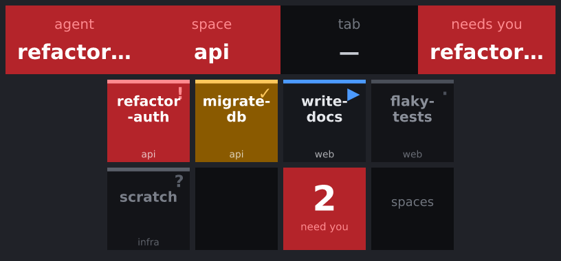

# What the default layout does

There is nothing to configure. herdr-deck reads the geometry of whatever deck is attached and
lays itself out to fit.

## Stream Deck + (8 keys, 4 dials, touchstrip)

| Control | What it does |
|---|---|
| Keys 1–6 | The first six agents **in attention order**. Press to focus, hold to acknowledge. |
| Key 7 | *Next attention* — jumps to the agent that needs you most. Dark when nothing does. |
| Key 8 | Toggles the deck between agents and workspaces. |
| Dial 1 | Rotate: scrub all agents. Press: focus. |
| Dial 2 | Rotate: cycle workspaces. Press: focus. |
| Dial 3 | Rotate: cycle tabs. Press: focus. |
| Dial 4 | Rotate: scrub **only** agents that need you. Press: focus. |

The touchstrip above each dial shows what that dial is pointing at, coloured by its status.
Tapping the strip does the same as pressing the dial under it.

## Reading a key



Each agent key shows its name, the workspace it lives in, and a status colour with a matching
glyph:

| Status | Colour | Glyph | Meaning |
|---|---|---|---|
| `blocked` | red | `!` | Needs input, approval, or a decision — **now**. |
| `done` | amber | `✓` | Finished, and you have not looked at it yet. |
| `working` | dark, blue accent | `▶` | Running. |
| `idle` | dim | `·` | Finished or waiting, and already seen. |
| `unknown` | dim | `?` | herdr could not classify it. |
| *acknowledged* | dim | `×` | You dismissed it with a long press; see [attention](../concepts/attention.md). |

Status is never carried by colour alone — every state has its own glyph too.

A focused agent gets a bright ring around its key, so you can see where herdr currently is.

An agent that is `blocked` or `done` also shows how long it has been asking, in the corner
opposite its glyph — `<1m`, `1m+` or `5m+` — with a status bar that thickens as the wait grows.
Three buckets rather than a running clock, for good reasons; see
[attention](../concepts/attention.md#how-long-it-has-been-asking).

## Pressing and holding

Every agent key has two actions. A press focuses the agent, taking you there and raising the
terminal window. **Holding it for half a second acknowledges it instead**: it leaves the attention
queue, herdr is never called, and nothing moves on your screen. That is how you clear a row of
finished agents without your terminal jumping to the front once per key.

Nothing else on the deck has a second action, so every other key still acts the moment you press
it.

## Other hardware

The layout adapts by *capability*, not by model name:

| Hardware | What changes |
|---|---|
| **XL** (32 keys) | 20 agent keys, paging keys because there are no dials to scrub with, and the whole bottom row given to [pane control](#pane-control-on-large-decks). |
| **MK.2** (15 keys) | 11 agent keys plus paging. |
| **Mini** (6 keys) | 4 agent keys, next-attention, and the mode toggle. |
| **Neo** (8 keys) | Same as Mini's approach, with 6 agent keys. |
| **Pedal** (no screens) | Nothing is drawn. Pedal 1 jumps to the agent that needs you; 2 and 3 step through the attention queue. |
| **Anything newer** | Laid out from its reported geometry. Unknown hardware still works. |

See it for yourself without owning the hardware:

```sh
herdr-deck layout --model xl
herdr-deckd --dry-run /tmp/tiles --dry-run-model xl
```

## Pane control on large decks

A deck with **24 keys or more** also gets a pane cluster — on an XL it is the entire bottom row:

| Key | Shape | What it does |
|---|---|---|
| left / right / up / down | a solid arrow | Moves herdr's focus one pane that way, inside the tab you are already on. |
| zoom | a pane with a filled centre | Makes the focused pane fill its tab. |
| unzoom | a pane split into four | Puts the panes back. |
| split right / split down | a pane with one half filled | Opens a new shell beside or below the one you are in, and focuses it. |

These read by shape, not by caption — they sit in a block and are pressed by feel. Each shape is a
distinct silhouette, so which key is which survives being seen from an angle or out of the corner
of an eye.

Two things they deliberately do **not** do.

They never raise the terminal window. An agent key is half a journey until the window comes
forward; a pane key is something you press while sitting at the terminal it is about. Raising
anyway would spend a round trip on every press and, on a desktop that
[cannot raise windows](../focus/gnome-wayland.md), would make every one of these keys alert.

Pressing a direction at the edge of a layout does nothing and **says nothing**. herdr reports
"there is no pane that way" as a plain answer rather than an error, and so does the deck — a thumb
run along a row of arrows reaches an edge every time, and a key that flashed an alert for it would
train you to ignore the alerts that matter. The press is still recorded, as `unchanged`, in the
[command log](../reference/architecture.md).

Smaller decks get none of this by default: four arrows would be half a Stream Deck +, and the
agents are why the deck is on the desk. Bind what you want by hand — see
[configuration](../reference/configuration.md#pane-control). On an eight-key deck, left and right
alone are usually the better trade: most layouts are one split wide, and up and down earn their
keys only if yours are genuinely two-dimensional.

**Closing a pane is never given to you.** It exists, it is guarded by a hold, and you have to ask
for it in your config.

## The ordering rule

Agents sort by status band first — `blocked`, then `done`, then `working`, then `idle`, then
`unknown` — and within a band, the most recently changed comes first.

So when three agents are blocked, the one that *just* blocked is on key 1. Ties break on a stable
id, so keys never shuffle between repaints.
